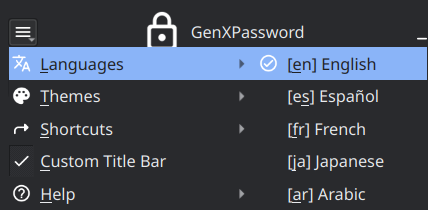

<h1 align="center">GenXPassword</h1>

<p align="center">
  
  
  
  <br>
</p>

<p align="center"><i>Shuffled random and customizable password generator.</i></p>


<div align="center">
  
   
</div>

 
## Features
* Support for languages: Arabic, English, French, Japanese, Spanish.
* Generates passwords of variable length, from 1 to 512 characters.
* Support for custom characters.
* TrayIcon Available
* Modular source code
* Cross-Platform
  - Windows, MacOS and Linux.

<div  align="center" >
  
</div>

## Requirements
**Windows:** No requirements<br>
**Linux:** Any X11/Xorg-based windowing system, QT-6<br>
**MacOS:** Unknown.

## Usage & build

```bash
qmake
make
./build/bin/GenXPassword
```

## Installation

### Unix like systems

### Windows

### MacOS