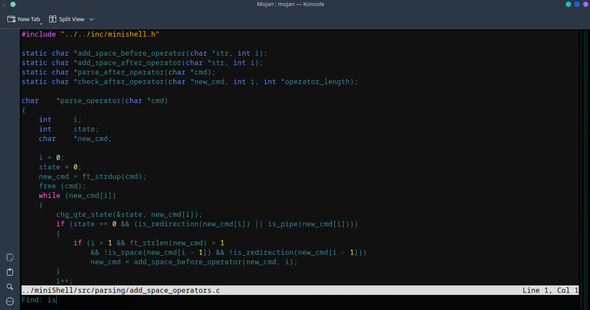

# Mojan Text Editor

A simple, minimal & performant text editor written in C with C's Standard Library and `glib`.



> [!NOTE]
> This project is undergoing refactoring at the moment.

## Syntax highlighting supported for

- C/C++
- JavaScript
- Python
- SQL

## Installation

- Make sure that `gcc` & `make` are installed.
- Make _install.sh_ file executable.
  ```
  chmod +x install.sh
  ```
- Execute the installation script.
  ```
  ./install.sh
  ```

## Build

```
make mojan
```

## Usage

```
mojan [FILE]
```

## Planned Features

- Undo & redo
- Text replace
- Colored bracket pair
- Syntax highlighting for other languages like Cpp, Java, TS, Julia, C#, many more...