# C++ Projects **PlayGround** #

<!-- ### I made this repo to make more C++ projects and implement new things I always wanted to try -->
<!-- 
### **This repo** will contain some forked or cloned repos from other users, their credit will be found in every *README* of each directory and it will be edited to my need
 -->
<pre lang="cpp">
      I hope this repository continues to grow and teaches me
       new things about this fascinating programming language
      ._._._._._._._._._._._._._._._._._._._._._._._._._._._._.

<strong>
         *   .   `   .  ` *  `  .   *   .   `   .   `   .   +   
                  ________        *    .      .     *   .
                /   _____  \    .    *     `     .  `   .     *
               |  /     \   |       .  `  .   *   .   +   .  `  
               |  |      ¯¯¯ _||__||_   `    .   ,   `   .   *
               |  |       __ ¯||¯¯||¯   PLAYGROUND  .  *    .  
                \  \_____/  |       .  `  *   .  +   .  `  *  ,
                 \_________/    .  *   .   `   .  ` *  `  .  
        *  .  `  .   *   .   +   .  `   *   .   `   .  ` *  `  .  
</strong>
      .~.~.~.~.~.~.~.~.~.~.~.~.~.~.~.~.~.~.~.~.~.~.~.~.~.~.~.~.

</pre>

# 📚 Table of Contents

  &emsp; - [**Overview**](#overview)

  &emsp; - [**Side Note**](#side-note)

  
<strong>🧾 Projects Titles</strong>

   

  <table style="width:100%; border-collapse: collapse; border: 1px solid #ddd;">
    <thead>
      <tr style="">
        <th style="padding:4px 8px; text-align:center; word-wrap:break-word; font-weight:bold; border: 1px solid #ddd;">A-I</th>
        <th style="padding:4px 8px; text-align:center; word-wrap:break-word; font-weight:bold; border: 1px solid #ddd;">I-R</th>
        <th style="padding:4px 8px; text-align:center; word-wrap:break-word; font-weight:bold; border: 1px solid #ddd;">R-Z</th>
      </tr>
    </thead>
    <tbody>
      <tr>
        <td style="padding:4px 8px; text-align:center; word-wrap:break-word; border: 1px solid #ddd;"><a href="#atari-games">Atari Games</a></td>
        <td style="padding:4px 8px; text-align:center; word-wrap:break-word; border: 1px solid #ddd;"><a href="#introspective">Introspective</a></td>
        <td style="padding:4px 8px; text-align:center; word-wrap:break-word; border: 1px solid #ddd;"><a href="#regular-expression-convertors">Regular Expression Convertors</a></td>
      </tr>
      <tr>
        <td style="padding:4px 8px; text-align:center; word-wrap:break-word; border: 1px solid #ddd;"><a href="#beneficial-c-programming">Beneficial C Programming</a></td>
        <td style="padding:4px 8px; text-align:center; word-wrap:break-word; border: 1px solid #ddd;"><a href="#js-compiler">JS Compiler</a></td>
        <td style="padding:4px 8px; text-align:center; word-wrap:break-word; border: 1px solid #ddd;"><a href="#sfml-multithread-verlet">SFML Multithread Verlet</a></td>
      </tr>
      <tr>
        <td style="padding:4px 8px; text-align:center; word-wrap:break-word; border: 1px solid #ddd;"><a href="#chess-3d">Chess 3D</a></td>
        <td style="padding:4px 8px; text-align:center; word-wrap:break-word; border: 1px solid #ddd;"><a href="#json-converter">Json Converter</a></td>
        <td style="padding:4px 8px; text-align:center; word-wrap:break-word; border: 1px solid #ddd;"><a href="#simple-code">Simple Code</a></td>
      </tr>
      <tr>
        <td style="padding:4px 8px; text-align:center; word-wrap:break-word; border: 1px solid #ddd;"><a href="#chess-engine">Chess Engine</a></td>
        <td style="padding:4px 8px; text-align:center; word-wrap:break-word; border: 1px solid #ddd;"><a href="#key-to-value">Key to Value</a></td>
        <td style="padding:4px 8px; text-align:center; word-wrap:break-word; border: 1px solid #ddd;"><a href="#simple-turso">Simple Turso</a></td>
      </tr>
      <tr>
        <td style="padding:4px 8px; text-align:center; word-wrap:break-word; border: 1px solid #ddd;"><a href="#collatz-conjecture">Collatz Conjecture</a></td>
        <td style="padding:4px 8px; text-align:center; word-wrap:break-word; border: 1px solid #ddd;"><a href="#marble-marcher">Marble Marcher</a></td>
        <td style="padding:4px 8px; text-align:center; word-wrap:break-word; border: 1px solid #ddd;"><a href="#simplesdl2-game-template">Simplesdl2 Game Template</a></td>
      </tr>
      <tr>
        <td style="padding:4px 8px; text-align:center; word-wrap:break-word; border: 1px solid #ddd;"><a href="#cpp20-develop">CPP20 Develop</a></td>
        <td style="padding:4px 8px; text-align:center; word-wrap:break-word; border: 1px solid #ddd;"><a href="#matrix-screensaver">Matrix ScreenSaver</a></td>
        <td style="padding:4px 8px; text-align:center; word-wrap:break-word; border: 1px solid #ddd;"><a href="#staticpagegen">StaticPageGen</a></td>
      </tr>
      <tr>
        <td style="padding:4px 8px; text-align:center; word-wrap:break-word; border: 1px solid #ddd;"><a href="#customized-operators">Customized Operators</a></td>
        <td style="padding:4px 8px; text-align:center; word-wrap:break-word; border: 1px solid #ddd;"><a href="#minishell">MiniShell</a></td>
        <td style="padding:4px 8px; text-align:center; word-wrap:break-word; border: 1px solid #ddd;"><a href="#system-monitor">System Monitor</a></td>
      </tr>
      <tr>
        <td style="padding:4px 8px; text-align:center; word-wrap:break-word; border: 1px solid #ddd;"><a href="#define-evil">Define Evil</a></td>
        <td style="padding:4px 8px; text-align:center; word-wrap:break-word; border: 1px solid #ddd;"><a href="#mojan">Mojan</a></td>
        <td style="padding:4px 8px; text-align:center; word-wrap:break-word; border: 1px solid #ddd;"><a href="#template-language-generator">Template Language Generator</a></td>
      </tr>
      <tr>
        <td style="padding:4px 8px; text-align:center; word-wrap:break-word; border: 1px solid #ddd;"><a href="#design-patterns">Design Patterns</a></td>
        <td style="padding:4px 8px; text-align:center; word-wrap:break-word; border: 1px solid #ddd;"><a href="#ofxasync">OfxAsync</a></td>
        <td style="padding:4px 8px; text-align:center; word-wrap:break-word; border: 1px solid #ddd;"><a href="#thread-pool">Thread Pool</a></td>
      </tr>
      <tr>
        <td style="padding:4px 8px; text-align:center; word-wrap:break-word; border: 1px solid #ddd;"><a href="#dump-c">Dump C++</a></td>
        <td style="padding:4px 8px; text-align:center; word-wrap:break-word; border: 1px solid #ddd;"><a href="#tokenizer-tok">Tokenizer Tok</a></td>
        <td style="padding:4px 8px; text-align:center; word-wrap:break-word; border: 1px solid #ddd;"><a href="#opengl-examples">OpenGL Examples</a></td>
      </tr>
      <tr>
        <td style="padding:4px 8px; text-align:center; word-wrap:break-word; border: 1px solid #ddd;"><a href="#file-lock-socket">File Lock Socket</a></td>
        <td style="padding:4px 8px; text-align:center; word-wrap:break-word; border: 1px solid #ddd;"><a href="#trigonometric-functions">Trigonometric Functions</a></td>
        <td style="padding:4px 8px; text-align:center; word-wrap:break-word; border: 1px solid #ddd;"><a href="#volumetric-clouds">Volumetric Clouds</a></td>
      </tr>
      </tr>
      <tr>
        <td style="padding:4px 8px; text-align:center; word-wrap:break-word; border: 1px solid #ddd;"><a href="#genxpassword">GenXPassword</a></td>
        <td style="padding:4px 8px; text-align:center; word-wrap:break-word; border: 1px solid #ddd;"><a href="#pipes-screensaver">Pipes ScreenSaver</a></td>
        <td style="padding:4px 8px; text-align:center; word-wrap:break-word; border: 1px solid #ddd;"><a href="#vitefa-config">ViteFA Config</a></td>
      <tr>
        <td style="padding:4px 8px; text-align:center; word-wrap:break-word; border: 1px solid #ddd;"><a href="#hangman">Hangman</a></td>
        <td style="padding:4px 8px; text-align:center; word-wrap:break-word; border: 1px solid #ddd;"><a href="#pong">POng</a></td>
        <td style="padding:4px 8px; text-align:center; word-wrap:break-word; border: 1px solid #ddd;"><a href="#wordproc">WordProc</a></td>
      </tr>
      <tr>
        <td style="padding:4px 8px; text-align:center; word-wrap:break-word; border: 1px solid #ddd;"><a href="#injecthook">InjectHook</a></td>
        <td style="padding:4px 8px; text-align:center; word-wrap:break-word; border: 1px solid #ddd;"><a href="#random-utility-tools">Random Utility Tools</a></td>
      </tr>
    </tbody>
  </table>

## Overview
This repository serves as a personal playground for experimenting with various C++ projects. It includes original implementations, as well as **forked** or **cloned** repositories from other developers **with my own improvements** where applicable. Each project aims to explore different concepts and features of the C++ programming language.

### Side note:
Projects are organized alphabetically for easy navigation. Each corresponding *README* file provides specific details, usage instructions, and credits for any borrowed code.

<!-- 
 TODO: add contribution section "how to contribute"
 -->

## Projects

### [Atari Games](./Atari-Games) 

A collection of classic Atari-inspired games, implemented in C++:

1. **2048** - [**(ⅰ)**](https://en.wikipedia.org/wiki/2048_(video_game))
  
    [2048_AI](./Atari-Games/2048_AI/) is a set of AI strategies that play the popular [2048 tile-merging game](https://github.com/gabrielecirulli/2048).

    **Try it on the** [website](https://ibra-kdbra.github.io/JS_game_collections/2048/index.html)
        

2. **Snake** - [**(ⅰ)**](https://en.wikipedia.org/wiki/Snake_(video_game_genre))

    A classic snake game made in C++ using SFML library.

3. **Tetris** - [**(ⅰ)**](https://en.wikipedia.org/wiki/Tetris)

    Simple Tetris™ — one of the smallest Tetris implementations in the world!
Utilizing only ANSI escape sequences to draw the board.

&emsp; **Preview:**    

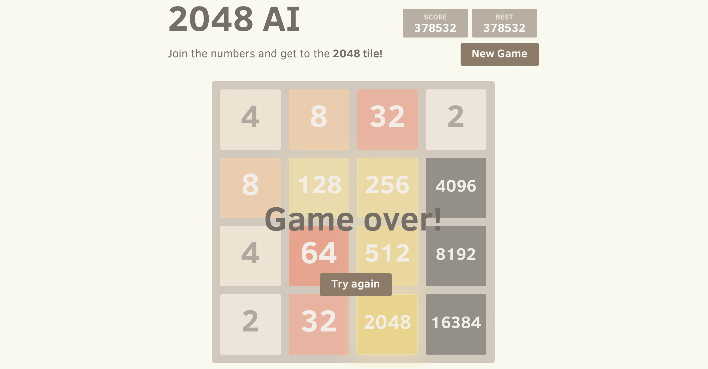

 

 
<a href="#projects-titles"> 📚 </a>

#

### [Beneficial C-Programming](./Beneficial-C_programming)
*Compile and execute C "scripts" in one go!*

 A shell script designed to streamline the process of compiling and executing C (and C++) scripts with unparalleled speed. This tool allows users to run C code directly from the command line or via shebang, making it as convenient as running shell scripts. With support for multiple files and customizable compiler options.

&emsp; **Preview:**  

&emsp; 

 
<a href="#projects-titles"> 📚 </a>

#

### [Chess 3D](./Chess_3D)

A simple 3D chess game that depends on GLFW and GLM, with U-R-C-F for game controls.

&emsp; **Preview:**  

&emsp; 

 
<a href="#projects-titles"> 📚 </a>

#

### [Chess Engine](./Chess_Engine)

A Chess Engine implemented in C++17.

 
<a href="#projects-titles"> 📚 </a>

#

### [Collatz Conjecture](./Collatz)

[Learn more](https://en.wikipedia.org/wiki/Collatz_conjecture) about the Collatz Conjecture.

A program that attempts to solve the Collatz Conjecture question, which asks whether repeating two simple arithmetic operations will eventually transform every positive integer into one.

 
<a href="#projects-titles"> 📚 </a>

#

### [CPP20 Develop](./CPP20_Develop)

`A versatile collection of compile-time optimized tools for C++ programming.`

This library uses the latest C++ features available in GCC, Clang and Visual Studio 2019 and 2022.

Co-Cpp19 contains numerous sublibraries and is split into many small headers.
This aims to enable the "pay only what you use policy" of C++ at compile time.

 
<a href="#projects-titles"> 📚 </a>

#

### [Customized Operators](./CustomizedOperators)

Implements custom operators for C++.

#### Like what?
In C++, one cannot create new operators such as `<>` or `|&`. However, you can create a variable named `x` of a newly created type with an irrelevant name and overload the operators `<` and `>` so that you can write `< x >`, creating new operators of sorts.

 
<a href="#projects-titles"> 📚 </a>

#

### [Define Evil](./define_evil)

*A macro library for the morally compromised C and C++ programmer.*

It's an MIT-licensed collection of clean, modular, well-documented macro hacks with full unit test coverage.

**Why?**

Complex macros are useful when pushing the limits of what C/C++ can do. For example, you could use `#define EVIL` macros to construct a domain-specific language that is technically C or C++ (compiled by any normal compiler) but looks and feels quite different. An extreme example of this is [Python++](https://github.com/wmww/Python-plus-plus), where many of these ideas originated. `#define EVIL` was created to split out and clean up the reusable bits of Python++.

 
<a href="#projects-titles"> 📚 </a>

#

### [Design Patterns](./Design-Patterns)

> _UNDER CONSTRUCTION_

 
<a href="#projects-titles"> 📚 </a>

#

### [Dump C++](./Dump_c%2B%2B)

*Dump C++ Itanium [ABI](https://en.wikipedia.org/wiki/Application_binary_interface) from [ELF](https://en.wikipedia.org/wiki/Executable_and_Linkable_Format) objects.*

A tool used to inspect C++ binaries for debug symbols ([Learn more](https://en.wikipedia.org/wiki/Debug_symbol)) and virtual function tables ([Learn more](https://en.wikipedia.org/wiki/Virtual_method_table)) information.

 
<a href="#projects-titles"> 📚 </a>

#

### [File Lock Socket](./FileLockSocket)

*Transfer files quickly and securely!*

The project utilizes [PBKDF2](https://en.wikipedia.org/wiki/PBKDF2) for key derivation, employs AES-256-GCM for encryption/decryption, and uses [SHA3-256](https://en.wikipedia.org/wiki/SHA-3) for integrity checks.

 
<a href="#projects-titles"> 📚 </a>

#

### [GenXPassword](./GenXPassword)

Shuffled random and customizable password generator.

#### Features
* Support for languages: Arabic, English, French, Japanese, Spanish.
* Generates passwords of variable length, from 1 to 512 characters.
* Support for custom characters.
* TrayIcon Available
* Modular source code
* Cross-Platform
  - Windows, MacOS and Linux.

**Preview:**

  
  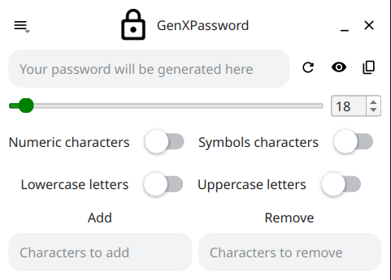 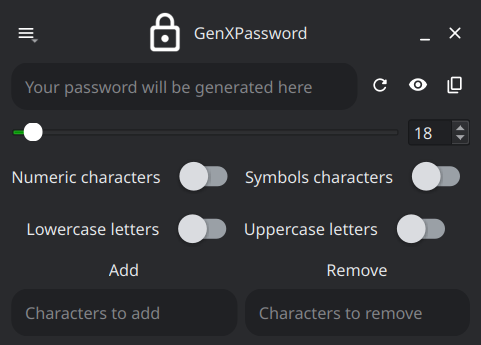

 
<a href="#projects-titles"> 📚 </a>

#
### [Hangman](./Hangman)

A simple Hangman game created using C++ and SFML.

**What is the Hangman game?** [Learn more](https://en.wikipedia.org/wiki/Hangman_(game))

**Features:**
- Word and hint loading from a CSV file.
- Hangman image updates based on incorrect guesses.
- Sound effects for win and lose conditions.

**Preview:**

&emsp;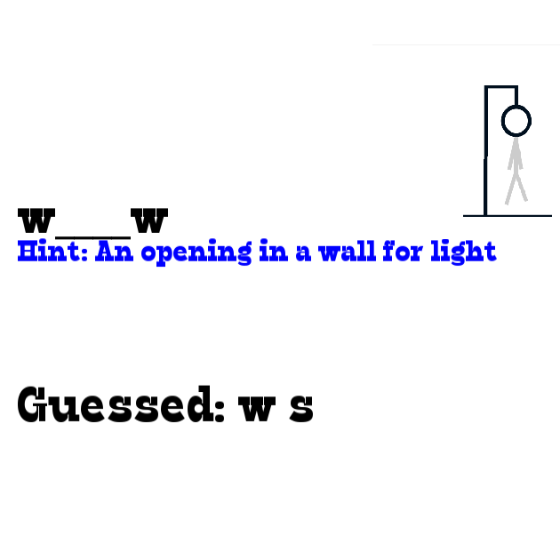 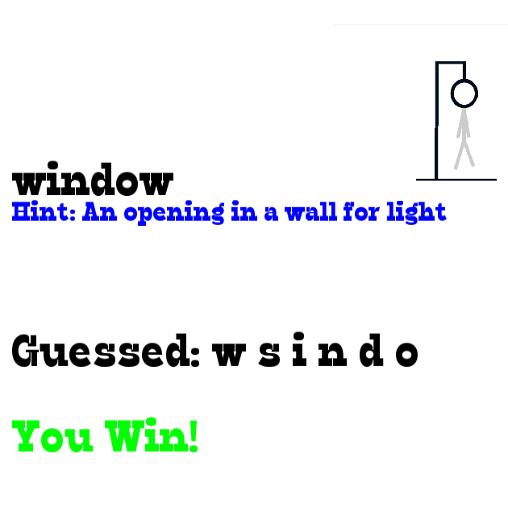

&emsp;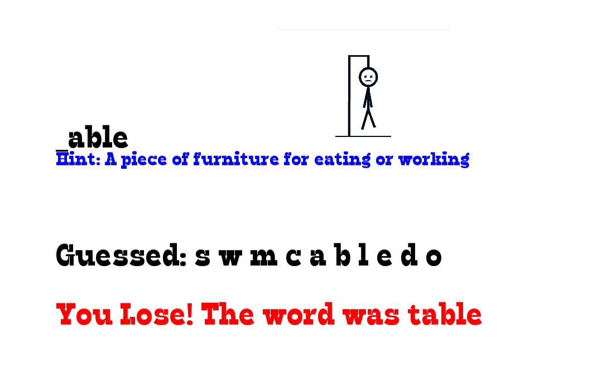

 
<a href="#projects-titles"> 📚 </a>

#

### [InjectHook](./InjectHook)

A lightweight C++ library designed for function interception within injected DLLs, providing a streamlined approach to modifying application behavior at runtime. It is ideal for educational purposes, debugging, and dynamic software analysis.

 
<a href="#projects-titles"> 📚 </a>

#

### [Introspective](./introspective)

Introspective is a header file that brings reflection to any class that wants it, regardless of whether the reflected member is a constant, a static variable, or an instance member function. It records declaration order, (function) type, and address, passing them along unchanged during compile-time, with the ultimate goal of making interaction with embedded scripting languages like Lua a little less of a hassle.

 
<a href="#projects-titles"> 📚 </a>

#

### [JS Compiler](./JS-compiler)

The goal of the project development was to learn the mechanisms of compilers. The project contains five parts:

1. A lexer
2. A parser
3. An interpreter
4. A compiler
5. A virtual machine

The designed programming language is similar to JavaScript but much simpler. Code samples can be found in each part's test case folder.

 
<a href="#projects-titles"> 📚 </a>

#

### [Json Converter](./JsonConverter)

A C++ library providing a `std::string` parser for JavaScript Object Notation (JSON). The STL containers are used to represent the JSON entities: Object, Array, and Value.

 
<a href="#projects-titles"> 📚 </a>

#

### [Key to Value](./KeyToValue/)

k2v (key-to-value) is a very very simple config file format.
It's simple, rigid, without super cow power, and maybe stupid.
It only designed for one purpose:    
- Get the `value` of the `key`.

 
<a href="#projects-titles"> 📚 </a>

#

### [Marble Marcher](./MarbleMarcher)

Marble Marcher is a video game demo that uses a fractal physics engine, and fully procedural rendering to produce beautiful, and unique gameplay unlike anything you've seen before.

The goal of the game is to reach the flag as quickly as possible, but be careful not to fall off the level or get crushed by the fractal! There are 24 levels to unlock.

 
<a href="#projects-titles"> 📚 </a>

#

### [Matrix ScreenSaver](./Matrix_ScreenSaver)

A *Matrix* terminal screen saver made in C.

&emsp;**Preview:**

&emsp;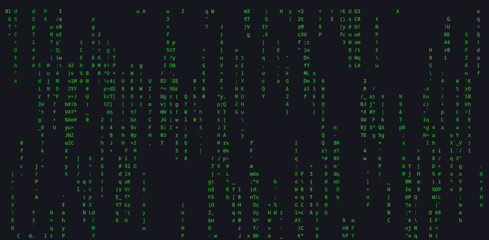

 
<a href="#projects-titles"> 📚 </a>

#

### [MiniShell](./miniShell)

Minishell is a simplified shell program that emulates a Unix-like shell environment. It is built using C and provides a basic command line interface (CLI) where users can interact with the system, execute commands, and manage environment variables. This project also includes implementations of several built-in commands such as `cd`, `echo`, `env`, and more.

&emsp; **Features:**

- Command parsing and execution
- Signal handling
- Heredoc support
- Environment variable management
- Execution of external commands
- Error handling
- Readline integration
- Compilation and Makefile

 
<a href="#projects-titles"> 📚 </a>

#

### [Mojan](./Mojan/)

A simple, minimal & performant text editor written in C with C's Standard Library and `glib`.

With **Syntax highlighting** supported for:

- C/C++
- JavaScript
- Python
- SQL

**Preview:**

 
<a href="#projects-titles"> 📚 </a>

#

### [OfxAsync](./ofxAsync)
An [openFrameworks](https://openframeworks.cc/) addon compatible with versions 0.9.8 to 0.10.1, designed to simplify multi-threading through a straightforward wrapper around [ofThread](https://openframeworks.cc/documentation/utils/ofThread/).

 
<a href="#projects-titles"> 📚 </a>

#

### [OpenGL Examples](./OpenGL_examples)
A collection of examples created while taking a Computer Graphics course to better understand OpenGL and apply techniques learned from the literature.

&emsp; **Preview:**

&emsp;
     
&emsp;   

 
<a href="#projects-titles"> 📚 </a>

#

### [Pipes ScreenSaver](./Pipes_ScreenSaver)

A *Pipes* terminal screen saver made in C.

&emsp;**Preview:**

&emsp;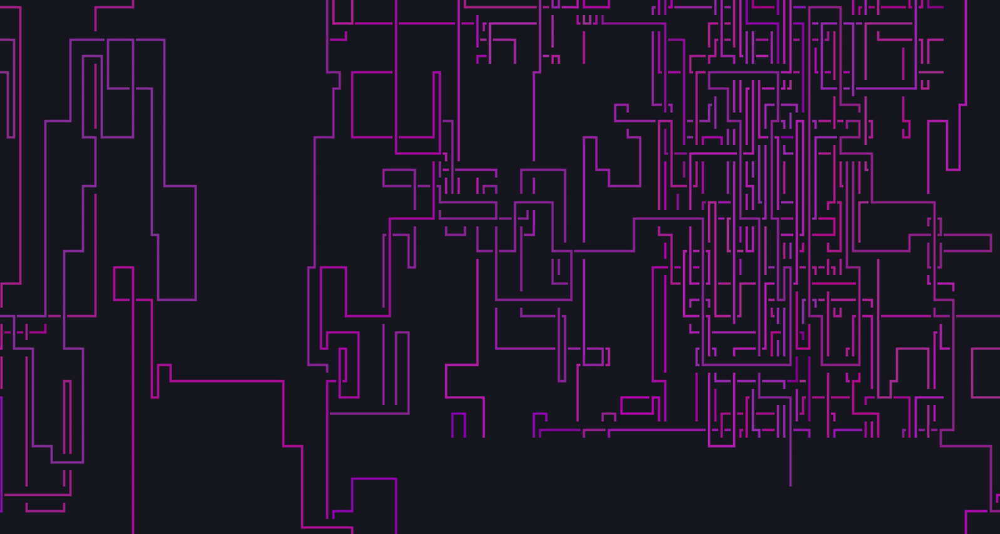

 
<a href="#projects-titles"> 📚 </a>

#

### [POng](./POng)

A Pong ([learn more](https://en.wikipedia.org/wiki/Pong)) clone for Linux written in C++ using SDL 2.0.

&emsp; **Preview:**

&emsp; 

 
<a href="#projects-titles"> 📚 </a>

#

### [Random Utility Tools](./Random_Utility_tools)

This subdirectory provides an overview of several converters used for instrument conversion between different formats such as BNK, IBK, and OPN. Each converter serves a specific purpose in processing sound patches and instrument banks.

&emsp; **Implemented converters:**
- OPN Dumper Converter
- BNK Patch Converters
- CSV Patch Set Converter
- IBK to OPL

 
<a href="#projects-titles"> 📚 </a>

#

### [Regular Expression Convertors](./RegularExpression_Convertors)

This project includes three converters:

- Regular Expression to Deterministic Finite Automata
- Regular Expression to Non-deterministic Finite Automata
- Regular Expression to Epsilon Non-deterministic Finite Automata

 
<a href="#projects-titles"> 📚 </a>

#

### [SFML Multithread Verlet](./SFML_Multithread_verlet/)

Demonstrates a **multithreaded particle simulation** using the **Verlet integration** method for calculating particle motion, with optimized **collision detection** and interaction. It leverages [**SFML**](https://en.wikipedia.org/wiki/Simple_and_Fast_Multimedia_Library) for rendering and handling the GUI.

**Key Features**:
- Multithreading
- Verlet Integration
- Optimized Collision Detection
- SFML (Simple and Fast Multimedia Library)

&emsp; **Preview:**

&emsp; 

 
<a href="#projects-titles"> 📚 </a>

#

### [Simple Turso](./simple_turso)

An experimental 3D/game engine technology partially based on the Urho3D codebase.

 
<a href="#projects-titles"> 📚 </a>

#

### [Simple Code](./Simple-Code)

A collection of algorithms and data structures implemented in C++ for educational purposes and practical applications.

**Brief View of Contents:**
- ALgorithms
- Data Structures
- Plain Approaches

**Preview:**

 

_Images above showcase the GUI of a **Binary Tree** implementation, as detailed in the [Plain Approaches](./Simple-Code/Plain_Approaches/Tree) section, as well as **A\*** implementation on Four Wheels problem as detailed in the [Algorithms](./Simple-Code/Algorithms/Backtracking/) section._

 
<a href="#projects-titles"> 📚 </a>

#

### [Simplesdl2 Game Template](./simplesdl2_game_template)

A template for a future game that I am currently working on.

&emsp; **Preview:**

&emsp; 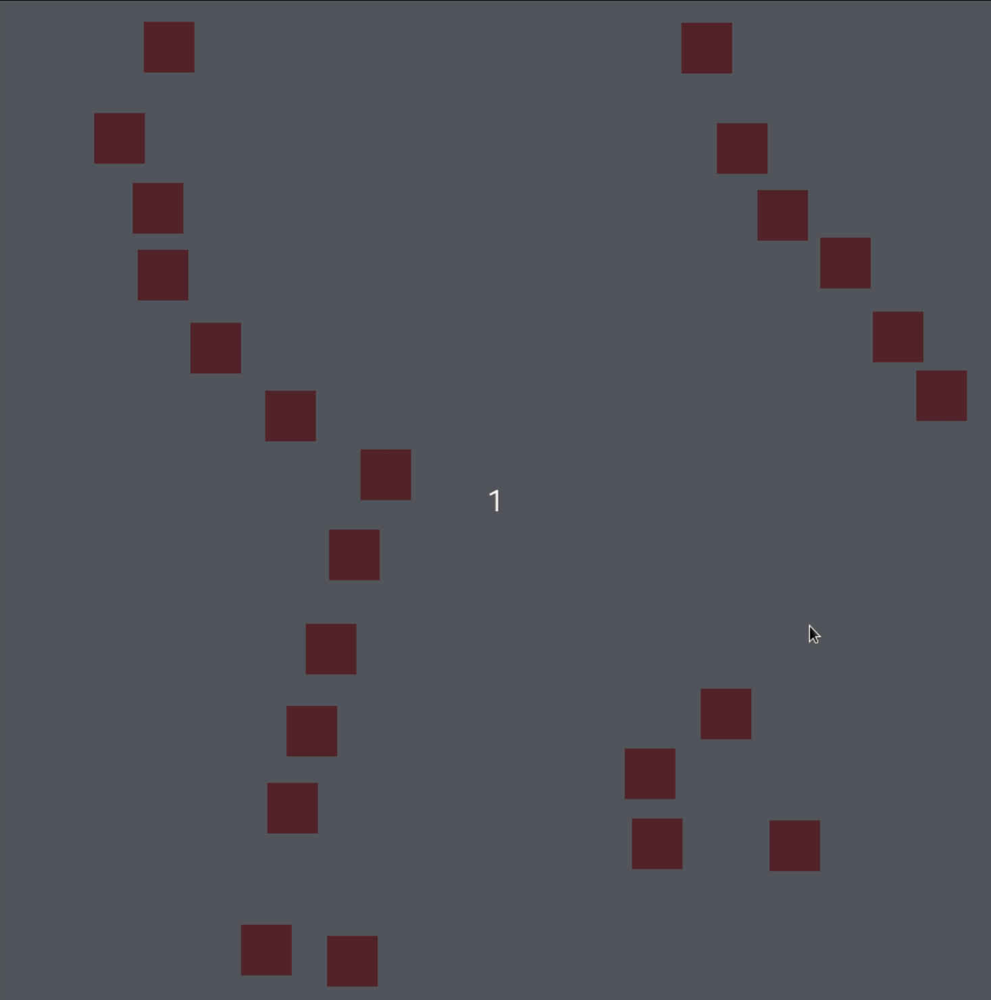 

 
<a href="#projects-titles"> 📚 </a>

#

### [StaticPageGen](./staticpagegen)

`staticpagegen` is a tool used to generate static pages for directory hierarchies, using the simplest possible form for the protocols it supports.

 
<a href="#projects-titles"> 📚 </a>

#

### [System Monitor](./SystemMonitor)

This project contains the result of the second project of the [Udacity C++ Nanodegree Program](https://www.udacity.com/course/c-plus-plus-nanodegree--nd213). The project involves creating a system monitor for the Linux Operating System, which depends on the [ncurses](https://www.gnu.org/software/ncurses/) library.

 
<a href="#projects-titles"> 📚 </a>

#

### [Template Language Generator](./Template_Language_Generator)

A small POSIX shell script for generating C/C++ code structures, build system files, and more.

 
<a href="#projects-titles"> 📚 </a>

#

### [Terminal File Manager](./Terminal_File_Manager)

A terminal file manager implemented in C++20 using the [ncurses](https://www.gnu.org/software/ncurses/) library.

&emsp; **Preview:**

&emsp; 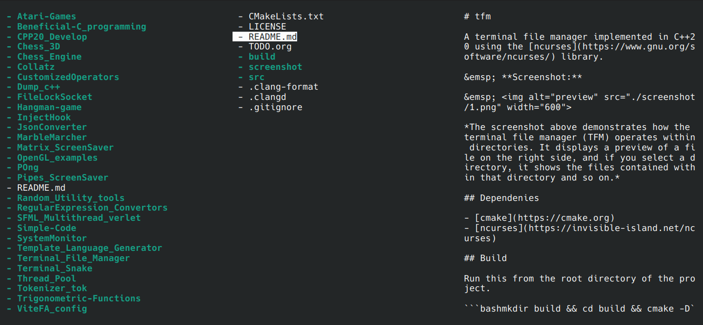 

 
<a href="#projects-titles"> 📚 </a>

#

### [Thread Pool](./Thread_Pool)

A thread pool is a software design pattern for achieving concurrency of execution in a computer program ([learn more](https://en.wikipedia.org/wiki/Thread_pool)).
This project is a simple async thread pool implementation in C++.

 
<a href="#projects-titles"> 📚 </a>

#

### [Tokenizer Tok](./Tokenizer_tok)

A simple, dependency-free, single-header *source code tokenizer* written in ANSI C. It features an easy-to-use interface for manipulating tokens and concatenating them back into a string.

 
<a href="#projects-titles"> 📚 </a>

#

### [Trigonometric Functions](./Trigonometric-Functions)

A small program that lets you visualize multiple trigonometric functions, built in C++ using OpenGL and GLUT.

&emsp; **Preview:**

&emsp;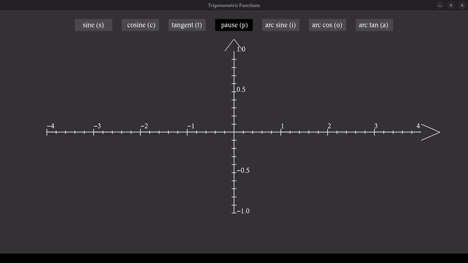

 
<a href="#projects-titles"> 📚 </a>

#

### [ViteFA Config](./ViteFA_config)

`ViteFA_config` is a highly efficient configuration management system implemented in **C**. It is designed to handle over 100,000 concurrent agent connections with sub-second propagation of configuration changes. The system uses **MySQL** for storage and relies on **libshmcache** for shared memory management. The shared memory type is configured to **mmap**, and `recycle_valid_entries` must be set to **false** for the cache.

 
<a href="#projects-titles"> 📚 </a>

#

### [Volumetric Clouds](./volumetric-clouds)

A real-time GPU volumetric clouds renderer via OpenGL, based on <a href="https://advances.realtimerendering.com/s2015/The%20Real-time%20Volumetric%20Cloudscapes%20of%20Horizon%20-%20Zero%20Dawn%20-%20ARTR.pdf">The Real-time Volumetric Cloudscapes of Horizon: Zero Dawn</a> by Andrew Schneider.

&emsp; **Preview:**

&emsp; 

 
<a href="#projects-titles"> 📚 </a>

#

### [WordProc](./WordProc)

An attempt to write a word processor using **C++20**, **Qt5**, and CMake as the build system.

 
<a href="#projects-titles"> 📚 </a>

#