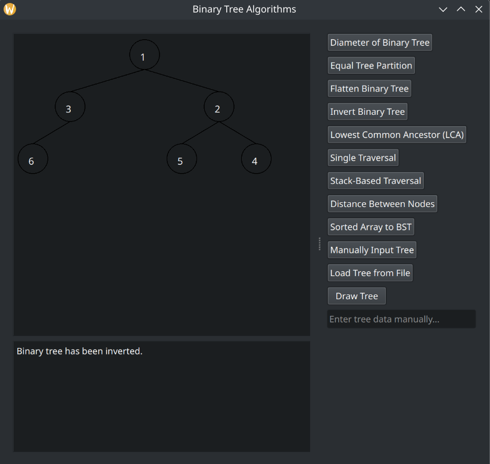

Binary Tree Algorithms
======================

**Contents:**
- [Overview](#overview)
- [Screenshots](#screenshots)
- [Setup and Usage](#setup-and-usage)

## Overview

This project features a GUI-based application showcasing various **Binary Tree** algorithms. Users can visually interact with the tree structure and execute the following algorithms:

- **Single Traversal:** Efficiently traverses the tree in one go to achieve specific goals.
- **Stack-Based Traversal:** Uses a stack to simulate recursive traversal.
- **Distance Between Nodes:** Computes the distance between two nodes or a node and the root.
- **Sorted Array to Balanced BST:** Converts a sorted array into a balanced Binary Search Tree.
- **Diameter of a Binary Tree:** Calculates the longest path between any two nodes in the tree.
- **Equal Tree Partition:** Determines if the tree can be divided into two equal sum partitions.
- **Flatten Binary Tree:** Converts the tree into a flattened linked list-like structure.
- **Invert Binary Tree:** Produces a mirror image of the binary tree.
- **Find Lowest Common Ancestor (LCA):** Includes two different approaches to locate the LCA of two nodes.

> [!NOTE]
> The program allows tree input via file. An example input file is provided [here](./Plain_Approaches/Tree/examples/)

<!-- 
TODO algorithms overview section
 -->
 
## Screenshots




## Setup and Usage

### Prerequisites

- A C++ compiler that supports C++11 or higher.
- Qt5 installed on your system.

### Usage

To build:
```shell
make
```
To run:
```
cd bin && ./binary_tree_gui
```

To clean:
```shell
make clean
```