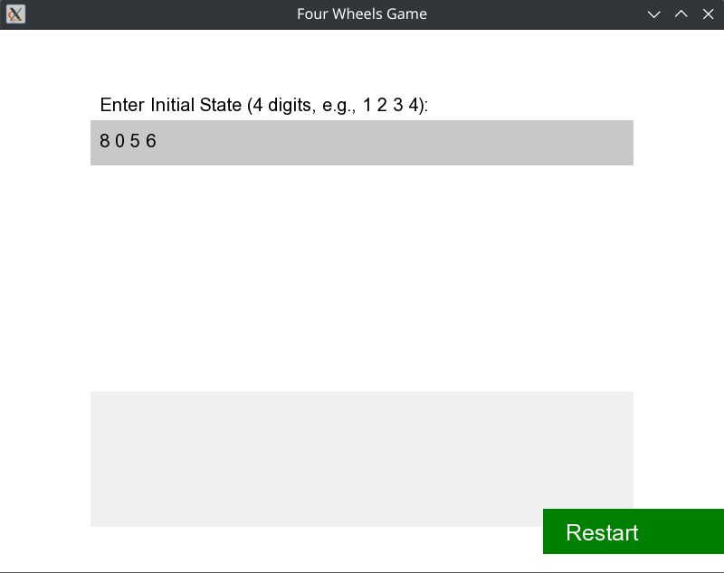
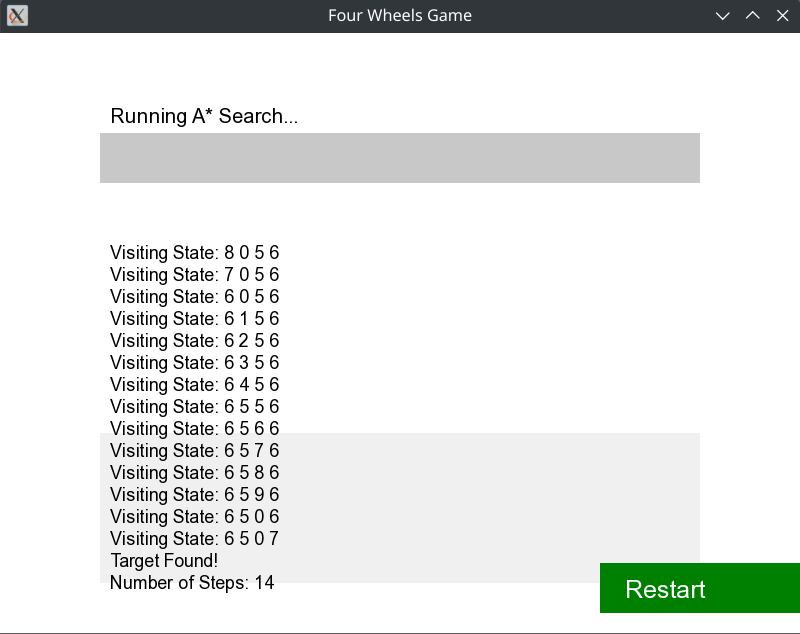
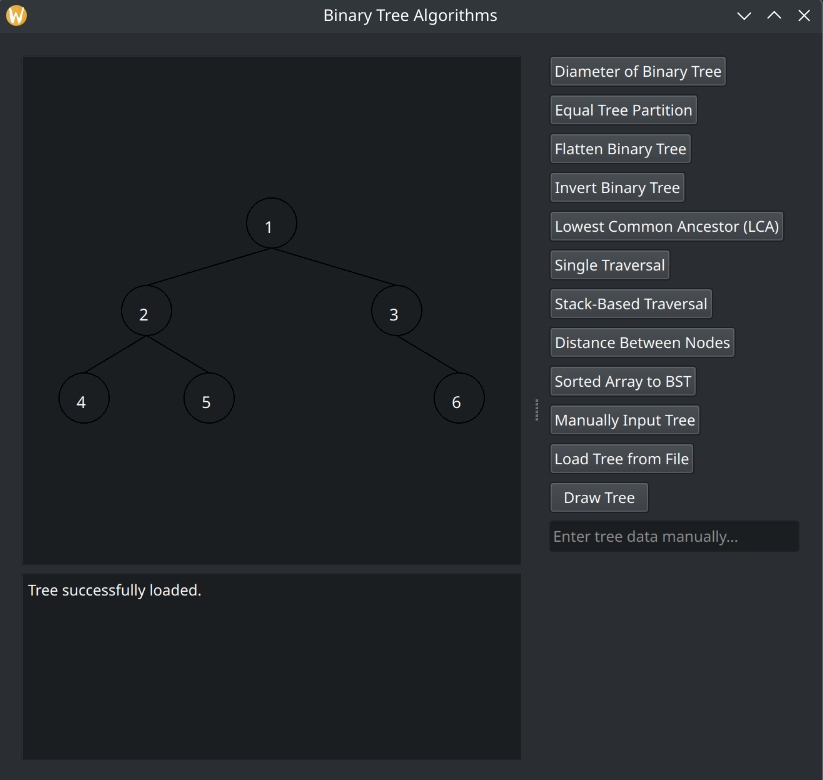
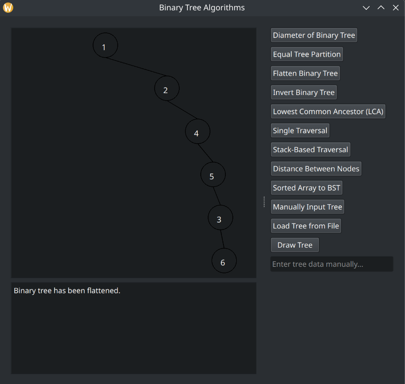

# Simple Code

A collection of algorithms and data structures implemented in C++ for educational purposes and practical applications.

## Contents
- [Algorithms](#algorithms)
- [Data Structures](#data-structures)
- [Plain Approaches](#plain-approaches)
- [How to Run](#how-to-run)

## [Algorithms](./Algorithms/)
The **Algorithms** directory contains the following categories:

-   ### Backtracking:

    Covers A* (A_Star) search implemented for [*Four Wheels*](https://www.cs.ucr.edu/~stelo/cs141winter04/prj3/prj3.pdf) problem. A detailed explanation is provided [here](./Algorithms/Backtracking/README.md).

    **Preview:**

     

- **Dynamic Programming**: Covers problems like Knapsack, Coin Change, Minimum Jumps, and more.
- **Graph Theory**: BFS, DFS, Dijkstra's, Bellman-Ford, Floyd-Warshall, etc.
- **Greedy**: Features problems like Sliding Window Maximum, Kadane's Algorithm, Connecting Ropes for Minimum Cost, Expedition Problem, and Load Balancer.
- **Recursion**: Balanced Brackets, Count Inversions, Recursive Multiplication, etc.
- **Searching**: Binary Search, Linear Search, Jump Search, and A* Search. Also includes matrix-specific search algorithms.
- **Sorting**: Bubble Sort, Selection Sort, Insertion Sort, Merge Sort, Quick Sort, Heap Sort, and Counting Sort.
- **Tree Algorithms**: Centroid of a Tree, and Lowest Common Ancestor (LCA) in a Binary Search Tree.


## [Data Structures](./Data%20Structure/)
Implemented data structures in various ways:
- Linked List
- Trie
- Heap
- Queue
- Stack
- Vector

### How to Run
1. Compile:
   ```sh
   g++ -o output_file source_file.cpp
    ```
    *Replace* `source_file` *with the actual file name.*
    
2. Execute:
    ```sh
    ./output_file
    ```

## [Plain Approaches](./Plain_Approaches/)

### [Binary Tree Algorithms ](./Plain_Approaches/Tree/)

This section features a GUI-based application showcasing various **Binary Tree** algorithms. Users can visually interact with the tree structure and execute the following algorithms:

- Single traversal
- Stack-based traversal
- Distance between nodes in a Binary Tree
- Convert sorted array to a balanced Binary Search Tree
- Diameter of a Binary Tree
- Equal tree partition
- Flatten Binary Tree
- Invert Binary Tree
- Find Lowest Common Ancestor

>Note: The program allows tree input via a file. An example input file is provided [here](./Plain_Approaches/Tree/examples/)

**Preview:**

 