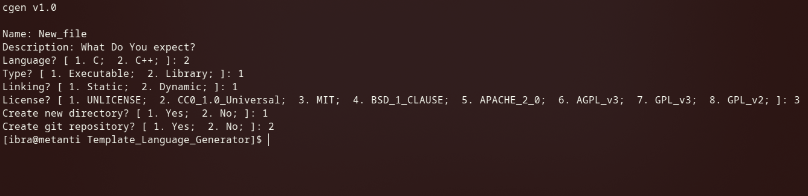

# Template Language Generator

A small POSIX shell script for generating C/C++ code structures, build system files, and more.

## Current Features

* C or C++
* Library or Executable
* Static or Dynamic (Linking)
* Automagically generates README, LICENSE and Makefiles

## Future Features

* Choose build system

### Example:

